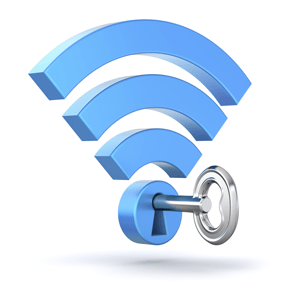

#Keamanan Jaringan Nirkabel

Saat ini sudah ada banyak sekali komunikasi yang bisa jatuh ke tangan orang lain, yang mana hal ini seringkali disalah gunakan. Untuk mengatasi hal ini maka sistem keamanan jaringan sangat dibutuhkan, karena mampu membantu untuk mengamankan jaringan tanpa adanya penghalang.

#Pengertian Sistem Keamanan Jaringan
Sistem keamamam jaringan komputer merupakan mesin yang digunakan dalam melakukan identifikasi dan melakukan pencegahan dari penggunaan yang tidak sesuai atau tidak sah pada jaringan komputer. Melalui sistem jaringan inilah dapat membantu untuk melakukan pencegahan dengan cara menghentikan pengguna yang tidak sesuai atau seringkali disebut sebagai penyusup.

#Manfaat Sistem Keamanan Jaringan

